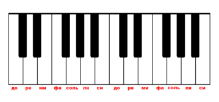

## Web-Пианино

Это задание поможет тебе побольше попрактиковаться в работе с DOM и CSS. Наверное, ты встречал(а) сервисы, которые предоставляют возможность поиграть на виртуальном пианино (например https://virtualpiano.net/). Теперь у тебя есть возможность написать собственную версию.

_Рисунок 1. Пример клавиатуры пианино (2 октавы)_

### Release 0

Сделай полноценную клавиатуру пианино как привидено на Рисунке 1. Каждая клавиша - `
`. Под клавиатурой размести еще один блок. Когда пользователь наводит курсор мышки и нажимает (`click`) на какую-либо клавишу на пианино, в ранее упомянутом блоке должно выводиться название соответствующей ноты (До, ре, ми, ... или C, D, E, ...).

### Release 1

Добавь еще один блок, либо можно работать с тем же блоком, в который выводится нота. Закругли углы у этого блока или примени какие-нибудь еще CSS-свойства, чтобы выглядело наиболее приятно для глаз пользователя. Теперь при нажатии на клавиши у этого блока должен меняться задний фон. Присвой каждой клавише свой цвет. Например:

| До (C)  | Ре (D)    | Ми (E) | Фа (F)  | Соль (G) | Ля (A) | Си (B)     |
| ------- | --------- | ------ | ------- | -------- | ------ | ---------- |
| Красный | Оранжевый | Желтый | Зеленый | Голубой  | Синий  | Фиолетовый |

Не обязательно придерживаться этой таблицы, можешь выбирать любые цвета.

### Release 2

Привяжи к каждой клавише пианино какую-нибудь клавишу на своей клавиатуре (события `keypress`, `keydown`, `keyup`).

Например:

| До (C) | Ре (D) | Ми (E) | Фа (F) | Соль (G) | Ля (A) | Си (B) |
| ------ | ------ | ------ | ------ | -------- | ------ | ------ |
| A      | S      | D      | F      | G        | H      | J      |

Теперь когда ты нажимаешь, например, клавишу `J` - в блоке для отображения нот должна появиться нота Си, а цвет должен измениться на Фиолетовый. Однако не обязательно делать именно такие цвета, и привязывать ноты именно к тем клавишам клавиатуры, которые рассмотренны тут.

### Release 3 (Опционально)

Ты сделал(а) клавиатуру, она вроде даже играет, выводит на экран ноты, но никто не услышит этой чудесной игры, если ты не подключишь воспроизведение соответствующих аудио файлов к каждому нажатию на клавиши. Можешь воспользоваться набором звуков из папки sounds или использовать свой.

### Release 4 (Опционально)

Доработай свое пианино до конца. Не забывай про черные клавиши (#-диез, ♭-бемоль) - они тоже должны играть и выводить соответствующие ноты на экран, а так же проигрываться по нажатию на клавиши клавиатуры.
